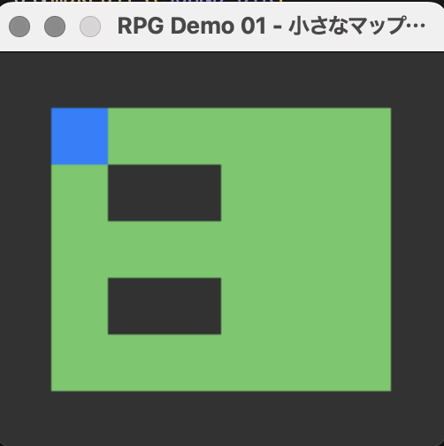

# 03：かべを つくって あたり判定を 実装しよう

このしょうでは、「かべ（壁）」をつくり、プレイヤーが かべに ぶつかる仕組み（あたり判定）を 実装します。
これで、本格的な 迷路（めいろ）ゲームの 基本的な機能が完成します。

## プログラムのもくてき

- マップに「かべ」を追加する
- プレイヤーが「かべ」にぶつかる「あたり判定」を実装する
- 衝突したときに、元の位置に戻す処理を作る



## コードのポイント

### 1. マップデータに「かべ」を追加

```python
# 小さなマップデータ（W: 壁, F: 床）
MAP_DATA = [
    "WWWWWWWW",
    "WFFFFFFW",
    "WFWWFFFW",
    "WFFFFFFW",
    "WFWWFFFW",
    "WFFFFFFW",
    "WWWWWWWW",
]
```

- `"W"` は Wall（かべ）、`"F"` は Floor（ゆか）を表します
- マップの外側を「かべ」で囲って、プレイヤーが外に出ないようにしています
- まっぷの中にも「かべ」を配置して、迷路のような構造を作っています

### 2. かべのクラスを定義

```python
class Wall(pygame.sprite.Sprite):
    def __init__(self, x, y):
        super().__init__()
        self.image = pygame.Surface((TILE_SIZE, TILE_SIZE))
        self.image.fill((50, 50, 50))  # 壁を示す色（グレー）
        self.rect = self.image.get_rect()
        self.rect.x = x
        self.rect.y = y
```

- `Wall` クラスは `pygame.sprite.Sprite` を継承（けいしょう）しています
- 見た目はグレー(50, 50, 50)の四角形です
- `self.rect` は四角形の位置と大きさの情報を持っています
- これを使って衝突判定（あたり判定）をおこないます

### 3. マップデータから「かべ」を生成

```python
# 壁スプライトグループを用意
wall_group = pygame.sprite.Group()
for row_idx, row in enumerate(MAP_DATA):
    for col_idx, tile in enumerate(row):
        if tile == "W":
            wall = Wall(col_idx * TILE_SIZE, row_idx * TILE_SIZE)
            wall_group.add(wall)
```

- マップデータを 2 重ループで調べて、`"W"`（かべ）を見つけたら
- その位置に `Wall` オブジェクトを作成します
- 作った `Wall` は `wall_group` というグループに追加します
- `pygame.sprite.Group` はスプライトを管理するためのクラスです

### 4. プレイヤーの移動と衝突判定

```python
def update(self, walls):
    keys = pygame.key.get_pressed()
    dx, dy = 0, 0
    # キー入力で移動方向を決定
    if keys[pygame.K_UP]:
        dy = -self.speed
    # ... 中略 ...

    # 移動前の位置を保存
    old_x, old_y = self.rect.x, self.rect.y

    # 移動を試みる
    self.rect.x += dx
    self.rect.y += dy

    # 壁との衝突があれば元に戻す
    for wall in walls:
        if self.rect.colliderect(wall.rect):
            self.rect.x = old_x
            self.rect.y = old_y
            break
```

- `update` 関数の引数に `walls`（かべのグループ）を追加しました
- `old_x, old_y = self.rect.x, self.rect.y` で移動前の位置を保存しています
- `self.rect.colliderect(wall.rect)` でプレイヤーとかべの衝突をチェックします
- 衝突していた場合は、移動前の位置 `old_x, old_y` に戻します
- `break` でループを抜けて、他の壁との判定をスキップします

## プログラムの実行の流れ

1. マップデータから「ゆか」と「かべ」の位置情報を取得
2. プレイヤーと壁のスプライトを生成
3. メインループで以下を繰り返す：
   - プレイヤーの移動処理（壁との衝突判定を含む）
   - 画面クリア（黒）
   - ゆかの描画（緑色）
   - 壁とプレイヤーの描画
   - 画面更新

## 最終的なコード

```
import pygame
import sys

# タイルサイズ
TILE_SIZE = 32  # 少し大きめにすると見やすいです

# 小さなマップデータ（W: 壁, F: 床）
MAP_DATA = [
    "WWWWWWWW",
    "WFFFFFFW",
    "WFWWFFFW",
    "WFFFFFFW",
    "WFWWFFFW",
    "WFFFFFFW",
    "WWWWWWWW",
]

# マップの高さ・幅を MAP_DATA から自動計算
MAP_HEIGHT = len(MAP_DATA)
MAP_WIDTH = len(MAP_DATA[0])

# スクリーンサイズ
SCREEN_WIDTH = MAP_WIDTH * TILE_SIZE
SCREEN_HEIGHT = MAP_HEIGHT * TILE_SIZE

class Wall(pygame.sprite.Sprite):
    def __init__(self, x, y):
        super().__init__()
        self.image = pygame.Surface((TILE_SIZE, TILE_SIZE))
        self.image.fill((50, 50, 50))  # 壁を示す色
        self.rect = self.image.get_rect()
        self.rect.x = x
        self.rect.y = y

class Player(pygame.sprite.Sprite):
    def __init__(self, x, y):
        super().__init__()
        self.image = pygame.Surface((TILE_SIZE, TILE_SIZE))
        self.image.fill((0, 128, 255))  # プレイヤーを示す色
        self.rect = self.image.get_rect()
        self.rect.x = x
        self.rect.y = y
        self.speed = 4

    def update(self, walls):
        keys = pygame.key.get_pressed()
        dx, dy = 0, 0
        if keys[pygame.K_UP]:
            dy = -self.speed
        elif keys[pygame.K_DOWN]:
            dy = self.speed
        if keys[pygame.K_LEFT]:
            dx = -self.speed
        elif keys[pygame.K_RIGHT]:
            dx = self.speed

        # 移動前の位置を保存
        old_x, old_y = self.rect.x, self.rect.y

        # 移動
        self.rect.x += dx
        self.rect.y += dy

        # 壁との衝突があれば元に戻す
        for wall in walls:
            if self.rect.colliderect(wall.rect):
                self.rect.x = old_x
                self.rect.y = old_y
                break

def main():
    pygame.init()
    screen = pygame.display.set_mode((SCREEN_WIDTH, SCREEN_HEIGHT))
    pygame.display.set_caption("RPG Demo 01 - 小さなマップでプレイヤー移動")

    # 壁スプライトグループを用意
    wall_group = pygame.sprite.Group()
    for row_idx, row in enumerate(MAP_DATA):
        for col_idx, tile in enumerate(row):
            if tile == "W":
                wall = Wall(col_idx * TILE_SIZE, row_idx * TILE_SIZE)
                wall_group.add(wall)

    # プレイヤーを配置
    # ここでは (1,1) タイル目あたりを開始座標にしています
    player = Player(1 * TILE_SIZE, 1 * TILE_SIZE)
    player_group = pygame.sprite.Group(player)

    clock = pygame.time.Clock()

    while True:
        clock.tick(60)

        for event in pygame.event.get():
            if event.type == pygame.QUIT:
                pygame.quit()
                sys.exit()

        # プレイヤー更新（壁との当たり判定含む）
        player_group.update(wall_group)

        # 画面クリア（背景を黒で塗りつぶし）
        screen.fill((0, 0, 0))

        # 床（F）のタイルを描画
        for row_idx, row in enumerate(MAP_DATA):
            for col_idx, tile in enumerate(row):
                if tile == "F":
                    pygame.draw.rect(
                        screen,
                        (100, 200, 100),
                        (col_idx * TILE_SIZE, row_idx * TILE_SIZE, TILE_SIZE, TILE_SIZE)
                    )

        # 壁とプレイヤーの描画
        wall_group.draw(screen)
        player_group.draw(screen)

        pygame.display.flip()

if __name__ == "__main__":
    main()
```

## まとめ

このバージョンでは、「かべ」と「あたり判定」という重要な要素を追加しました。  
これでゲームの基本的な枠組みが完成し、プレイヤーはかべで囲まれた迷路の中を動けるようになりました。  
次のステップでは、さらに「敵」を追加して、ゲーム性を高めていきます。
