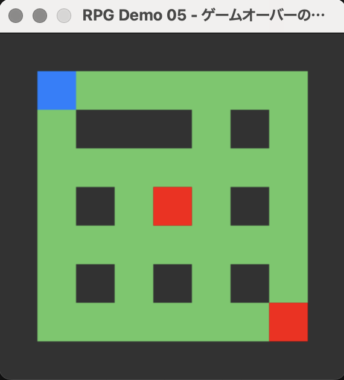

# 05：ゲームオーバーの実装

このしょうでは、「ゲームオーバー」の仕組みを実装します。  
敵（てき）に接触したときにゲームオーバーとなり、リトライできる機能を追加します。

:::message
ゲームには「今どんな状態か」を管理する仕組みが必要です。このプログラムでは「プレイ中」か「ゲームオーバー」かを変数で管理します。
:::

## プログラムのもくてき

- プレイヤーと敵の衝突判定を実装する
- ゲームオーバー状態の管理と表示を行う
- リトライ機能を実装する



## コードのポイント

### 1. ゲームオーバー状態の管理

```python
# グローバル変数でゲームオーバー状態を管理
global game_over
game_over = False
```

- `game_over` という変数でゲームの状態を管理します
- この変数はプログラム全体（グローバル）で共有される変数です
- `False` のときはゲーム進行中、`True` のときはゲームオーバー状態を表します

### 2. 衝突判定によるゲームオーバー判定

```python
def check_game_over(player, enemies):
    """プレイヤーと敵の衝突判定"""
    for enemy in enemies:
        if player.rect.colliderect(enemy.rect):
            return True
    return False
```

:::message alert
ゲームでは「ぶつかったかどうか」を調べる衝突判定がとても重要です！この関数はプレイヤーと敵がぶつかったかを調べています。
:::

- `check_game_over` 関数は、プレイヤーと敵の衝突を確認します
- `player.rect.colliderect(enemy.rect)` で、プレイヤーと敵の四角形（rect）が重なっているかを判定します
- 一つでも敵と衝突していれば `True` を返し、衝突していなければ `False` を返します

### 3. ゲームオーバー画面の表示

```python
def show_game_over(screen):
    """ゲームオーバー表示"""
    font = pygame.font.Font(None, 36)
    text = font.render('Game Over', True, (255, 0, 0))
    text_rect = text.get_rect(center=(SCREEN_WIDTH/2, SCREEN_HEIGHT/2))
    screen.blit(text, text_rect)

    font = pygame.font.Font(None, 36)
    retry_text = font.render('Press R to Retry', True, (255, 255, 255))
    retry_rect = retry_text.get_rect(center=(SCREEN_WIDTH/2, SCREEN_HEIGHT/2 + 50))
    screen.blit(retry_text, retry_rect)
```

- `pygame.font.Font` でテキスト表示用のフォントを作成します
- 大きなサイズ（74 ポイント）の赤い「Game Over」テキストを画面中央に表示します
- 小さめのサイズ（36 ポイント）の白い「Press R to Retry」テキストをその下に表示します
- `text_rect` を使ってテキストの表示位置を中央揃えにしています

### 4. ゲーム状態の初期化関数

```python
def init_game():
    """ゲーム状態の初期化"""
    # 壁の生成
    wall_group = pygame.sprite.Group()
    for row_idx, row in enumerate(MAP_DATA):
        for col_idx, tile in enumerate(row):
            if tile == "W":
                wall = Wall(col_idx * TILE_SIZE, row_idx * TILE_SIZE)
                wall_group.add(wall)

    # プレイヤーの生成
    player = Player(TILE_SIZE, TILE_SIZE)
    player_group = pygame.sprite.Group(player)

    # 敵の生成
    enemy_group = pygame.sprite.Group()
    enemy_positions = [(4, 4), (7, 7)]
    for ex, ey in enemy_positions:
        enemy = Enemy(ex * TILE_SIZE, ey * TILE_SIZE)
        enemy_group.add(enemy)

    return wall_group, player_group, enemy_group, player
```

:::message success
この関数は「ゲームをやり直す（リトライする）」ときにも使われます。同じコードを何度も書かずに、関数にまとめておくと便利です！
:::

- ゲームの初期状態を設定する関数を作成しました
- 壁、プレイヤー、敵のオブジェクトをそれぞれ生成し、それらのグループを返します
- リトライ時にこの関数を呼び出すことで、ゲームを初期状態に戻せます

### 5. 移動制限とリトライ機能

```python
# プレイヤーのupdate関数内
def update(self, walls):
    if not game_over:  # ゲームオーバーでない場合のみ移動可能
        keys = pygame.key.get_pressed()
        # （以下、移動処理）

# 敵のupdate関数内
def update(self, walls):
    if not game_over:  # ゲームオーバーでない場合のみ移動
        # （以下、移動処理）

# メインループ内
elif event.type == pygame.KEYDOWN:
    if event.key == pygame.K_r and game_over:
        # Rキーでリトライ
        game_over = False
        wall_group, player_group, enemy_group, player = init_game()
```

- `if not game_over:` という条件分岐により、ゲームオーバー時は移動処理をスキップします
- R キーが押されたとき、かつゲームオーバー状態のときに、ゲームを初期化します
- `init_game()` 関数を呼び出して、すべてのオブジェクトを初期位置に戻します

## プログラムの処理の流れ

1. ゲーム初期化：壁、プレイヤー、敵を生成し、`game_over = False` に設定
2. メインループで以下を繰り返す：
   - ゲームオーバーでなければ、プレイヤーと敵を更新
   - プレイヤーと敵の衝突を `check_game_over` で確認し、衝突していればゲームオーバーに
   - 床、壁、プレイヤー、敵を描画
   - ゲームオーバー状態であれば、`show_game_over` でゲームオーバー画面を表示
   - R キーが押されたら、ゲームを初期化してリトライ

## 技術的な解説

:::message
ゲームプログラミングでは「状態管理」「衝突判定」「テキスト表示」など、多くの技術を使います。これらの技術はほかのゲームでも役に立ちます。
:::

1. **状態管理**：グローバル変数 `game_over` を使ってゲームの状態を管理しています。この変数の値によって、キャラクターの動きや画面表示が変わります。

2. **衝突判定**：Pygame の `rect.colliderect()` メソッドを使って、プレイヤーと敵の四角形が重なっているかどうかを判定しています。

3. **テキスト描画**：Pygame の `font` モジュールを使って、ゲームオーバーメッセージを表示しています。テキストのレンダリングと位置調整を行っています。

4. **ゲーム初期化関数**：ゲームを最初からやり直すための `init_game()` 関数を作成しています。これにより、コードの再利用性が高まっています。

## 最終的なコード

```
import pygame
import sys
import random

# タイルサイズ
TILE_SIZE = 32

# マップデータ（W: 壁, F: 床）
MAP_DATA = [
    "WWWWWWWWW",
    "WFFFFFFFW",
    "WFWWWFWFW",
    "WFFFFFFFW",
    "WFWFWFWFW",
    "WFFFFFFFW",
    "WFWFWFWFW",
    "WFFFFFFFW",
    "WWWWWWWWW",
]

# マップの高さ・幅を MAP_DATA から自動計算
MAP_HEIGHT = len(MAP_DATA)
MAP_WIDTH = len(MAP_DATA[0])

# スクリーンサイズ
SCREEN_WIDTH = MAP_WIDTH * TILE_SIZE
SCREEN_HEIGHT = MAP_HEIGHT * TILE_SIZE

class Wall(pygame.sprite.Sprite):
    def __init__(self, x, y):
        super().__init__()
        self.image = pygame.Surface((TILE_SIZE, TILE_SIZE))
        self.image.fill((50, 50, 50))
        self.rect = self.image.get_rect()
        self.rect.x = x
        self.rect.y = y

class Player(pygame.sprite.Sprite):
    def __init__(self, x, y):
        super().__init__()
        self.image = pygame.Surface((TILE_SIZE, TILE_SIZE))
        self.image.fill((0, 128, 255))
        self.rect = self.image.get_rect()
        self.rect.x = x
        self.rect.y = y
        self.speed = 4

    def update(self, walls):
        if not game_over:  # ゲームオーバーでない場合のみ移動可能
            keys = pygame.key.get_pressed()
            dx, dy = 0, 0
            if keys[pygame.K_UP]:
                dy = -self.speed
            elif keys[pygame.K_DOWN]:
                dy = self.speed
            if keys[pygame.K_LEFT]:
                dx = -self.speed
            elif keys[pygame.K_RIGHT]:
                dx = self.speed

            old_x, old_y = self.rect.x, self.rect.y
            self.rect.x += dx
            self.rect.y += dy

            for wall in walls:
                if self.rect.colliderect(wall.rect):
                    self.rect.x = old_x
                    self.rect.y = old_y
                    break

class Enemy(pygame.sprite.Sprite):
    def __init__(self, x, y):
        super().__init__()
        self.image = pygame.Surface((TILE_SIZE, TILE_SIZE))
        self.image.fill((255, 0, 0))
        self.rect = self.image.get_rect()
        self.rect.x = x
        self.rect.y = y
        self.speed = 2
        self.move_timer = 0
        self.move_interval = 60

    def update(self, walls):
        if not game_over:  # ゲームオーバーでない場合のみ移動
            self.move_timer += 1
            if self.move_timer >= self.move_interval:
                self.move_timer = 0
                dx = random.choice([-1, 0, 1]) * self.speed
                dy = random.choice([-1, 0, 1]) * self.speed

                old_x, old_y = self.rect.x, self.rect.y
                self.rect.x += dx
                self.rect.y += dy

                for wall in walls:
                    if self.rect.colliderect(wall.rect):
                        self.rect.x = old_x
                        self.rect.y = old_y
                        break

def check_game_over(player, enemies):
    """プレイヤーと敵の衝突判定"""
    for enemy in enemies:
        if player.rect.colliderect(enemy.rect):
            return True
    return False

def show_game_over(screen):
    """ゲームオーバー表示"""
    font = pygame.font.Font(None, 36)
    text = font.render('Game Over', True, (255, 0, 0))
    text_rect = text.get_rect(center=(SCREEN_WIDTH/2, SCREEN_HEIGHT/2))
    screen.blit(text, text_rect)

    font = pygame.font.Font(None, 36)
    retry_text = font.render('Press R to Retry', True, (255, 255, 255))
    retry_rect = retry_text.get_rect(center=(SCREEN_WIDTH/2, SCREEN_HEIGHT/2 + 50))
    screen.blit(retry_text, retry_rect)

def init_game():
    """ゲーム状態の初期化"""
    # 壁の生成
    wall_group = pygame.sprite.Group()
    for row_idx, row in enumerate(MAP_DATA):
        for col_idx, tile in enumerate(row):
            if tile == "W":
                wall = Wall(col_idx * TILE_SIZE, row_idx * TILE_SIZE)
                wall_group.add(wall)

    # プレイヤーの生成
    player = Player(TILE_SIZE, TILE_SIZE)
    player_group = pygame.sprite.Group(player)

    # 敵の生成
    enemy_group = pygame.sprite.Group()
    enemy_positions = [(4, 4), (7, 7)]
    for ex, ey in enemy_positions:
        enemy = Enemy(ex * TILE_SIZE, ey * TILE_SIZE)
        enemy_group.add(enemy)

    return wall_group, player_group, enemy_group, player

def main():
    pygame.init()
    screen = pygame.display.set_mode((SCREEN_WIDTH, SCREEN_HEIGHT))
    pygame.display.set_caption("RPG Demo 05 - ゲームオーバーの実装")

    global game_over
    game_over = False

    # ゲーム初期化
    wall_group, player_group, enemy_group, player = init_game()
    clock = pygame.time.Clock()

    while True:
        clock.tick(60)

        for event in pygame.event.get():
            if event.type == pygame.QUIT:
                pygame.quit()
                sys.exit()
            elif event.type == pygame.KEYDOWN:
                if event.key == pygame.K_r and game_over:
                    # Rキーでリトライ
                    game_over = False
                    wall_group, player_group, enemy_group, player = init_game()

        if not game_over:
            # 更新処理
            player_group.update(wall_group)
            enemy_group.update(wall_group)

            # ゲームオーバー判定
            if check_game_over(player, enemy_group):
                game_over = True

        # 描画処理
        screen.fill((0, 0, 0))

        # 床の描画
        for row_idx, row in enumerate(MAP_DATA):
            for col_idx, tile in enumerate(row):
                if tile == "F":
                    pygame.draw.rect(
                        screen,
                        (100, 200, 100),
                        (col_idx * TILE_SIZE, row_idx * TILE_SIZE, TILE_SIZE, TILE_SIZE)
                    )

        # スプライトの描画
        wall_group.draw(screen)
        player_group.draw(screen)
        enemy_group.draw(screen)

        # ゲームオーバー表示
        if game_over:
            show_game_over(screen)

        pygame.display.flip()

if __name__ == "__main__":
    main()
```

## まとめ

このバージョンでは、ゲームオーバー機能とリトライ機能を実装しました。  
これにより、ゲームとしての「目的」（敵を避ける）と「結果」（ゲームオーバーまたは継続）が明確になり、ゲーム性が向上しました。

:::message alert
次のステップでは、ゲームにゴールの判定を作っていきます。
:::
